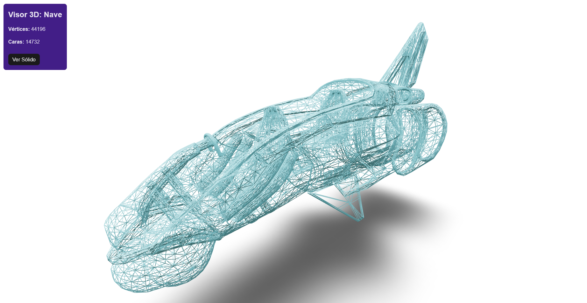
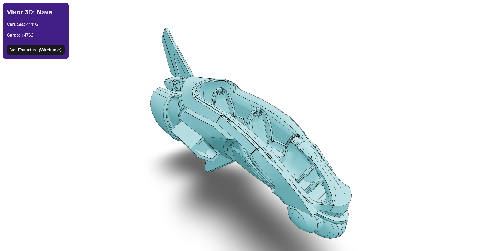
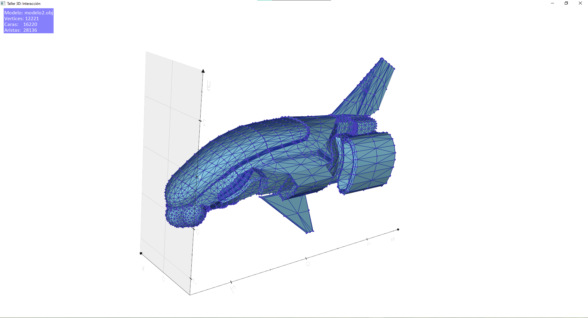

# Taller - Construyendo el Mundo 3D

**Estudiante:** Andres Felipe Galindo Gonzalez
**Fecha:** 21 de Febrero, 2026

## 📝 Descripción

Este taller explora las estructuras gráficas básicas que forman los modelos 3D (vértices, aristas y caras) mediante visualizaciones interactivas en diferentes plataformas como Python o Threejs.

## 🛠️ Implementaciones

### 1. Three.js con React Three Fiber

**Descripción:**
Este código implementa un visor de modelos 3D interactivo utilizando React y el ecosistema de Three.js. Su función principal es cargar un archivo externo, mostrarlo en pantalla y permitir al usuario alternar entre diferentes modos de visualización ya sea wireframe o solido.

**Características:**

- Carga de modelo 3D (.OBJ)
- Visualización de vértices, aristas y caras
- Controles orbitales para navegación
- Interfaz para alternar entre modos de visualización

**Tecnologías:**

- React
- Three.js
- React Three Fiber
- @react-three/drei

**Código relevante:**

```jsx
// Calcula la cantidad de vértices y caras
const geometry = useMemo(() => {
  let geo = null;
  obj.traverse((child) => {
    if (child.isMesh && !geo) {
      geo = child.geometry;
    }
  });

  if (geo && onLoadModel) {
    // Calculamos los datos
    const vCount = geo.attributes.position.count;
    const fCount = geo.index
      ? geo.index.count / 3
      : geo.attributes.position.count / 3;
    // Enviamos los datos al componente padre (App)
    onLoadModel({ vertices: vCount, faces: Math.round(fCount) });
  }
  return geo;
}, [obj, onLoadModel]);
```

**Resultados:**




---

### 2. Python (venv)

**Descripción:**
Este nuevo código implementa un script de procesamiento y exportación de visualizaciones 3D utilizando Python. A diferencia del anterior (que era una interfaz web), este se enfoca en la manipulación técnica de mallas, visualización de escritorio y la generación automática de contenido como el GIF.

**Características:**

- Análisis de estructura de malla
- Visualización con trimesh/vedo
- Información estadística del modelo

**Tecnologías:**

- Python 3.10+
- trimesh
- vedo
- matplotlib
- numpy

**Código relevante:**

```python
# Definimos la malla (caras y aristas)
# Color de caras, grosor de aristas y color de arista
vmesh = Mesh([mesh_data.vertices, mesh_data.faces]).c("#8ACCE5").lw(1).lc("#172291")

# Definimos los vértices como puntos independientes
vpoints = Points(mesh_data.vertices, c="#493db8", r=5)
```

**Resultados:**




---

## 🤖 Prompts Utilizados

"¿Cómo se puede implementar la manipulación de un objeto 3D (.OBJ) en Python y en Three.js?"

    "¿Cómo se cuentan los vértices, aristas y caras en los modelos 3D usando librerías de Python?"

    "Genera un formato para el README del taller, siguiendo las siguientes condiciones..."

    "Ayúdame a resolver el siguiente error técnico con la librería vedo en Python."

    "¿Cómo puedo crear un GIF de la animación automáticamente después de ejecutar el programa?"

    "Ayúdame a corregir la ortografía y redacción del siguiente texto explicativo sobre el taller."

    Nota: La gran mayoría de las consultas se centraron en la resolución de errores de dependencias.

## 📚 Aprendizajes

### Conceptos Clave

- **Vértices:** Puntos en el espacio 3D que definen la geometría
- **Aristas:** Líneas que conectan vértices
- **Caras:** Polígonos (generalmente triángulos) formados por vértices

### Descubrimientos

Un OBJ puede ser un escena que se refiere a un conjunto de elementos o objetos en posiciones relativas, o puede ser un solo objeto solido; por otro lado la libreria vedo es de gran importancia ya que ayuda a calcular los numeros de trimesh en pixeles.

## 🔧 Dificultades Encontradas

- Instalación de las herramientas de trabajo.

## 🚀 Cómo Ejecutar

### Three.js

```bash
cd threejs
npm install
npm run dev
```

### Python

```bash
cd python
python modelo_python.py
```

## 🔗 Referencias

- [Three.js Documentation](https://threejs.org/)
- [React Three Fiber](https://docs.pmnd.rs/react-three-fiber)
- [Trimesh Documentation](https://trimsh.org/)
