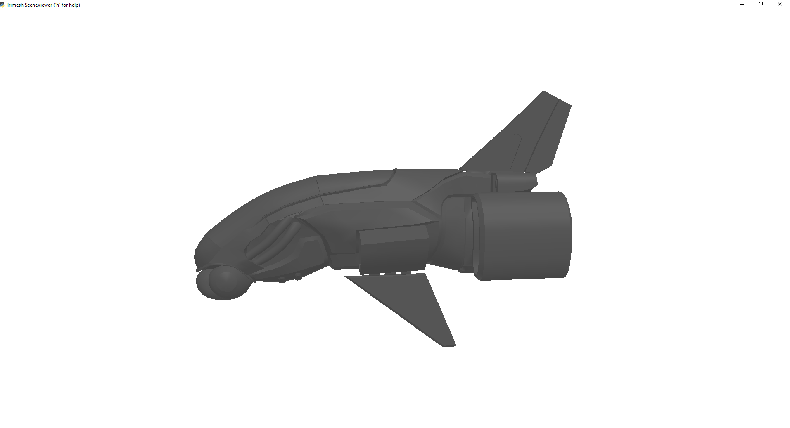
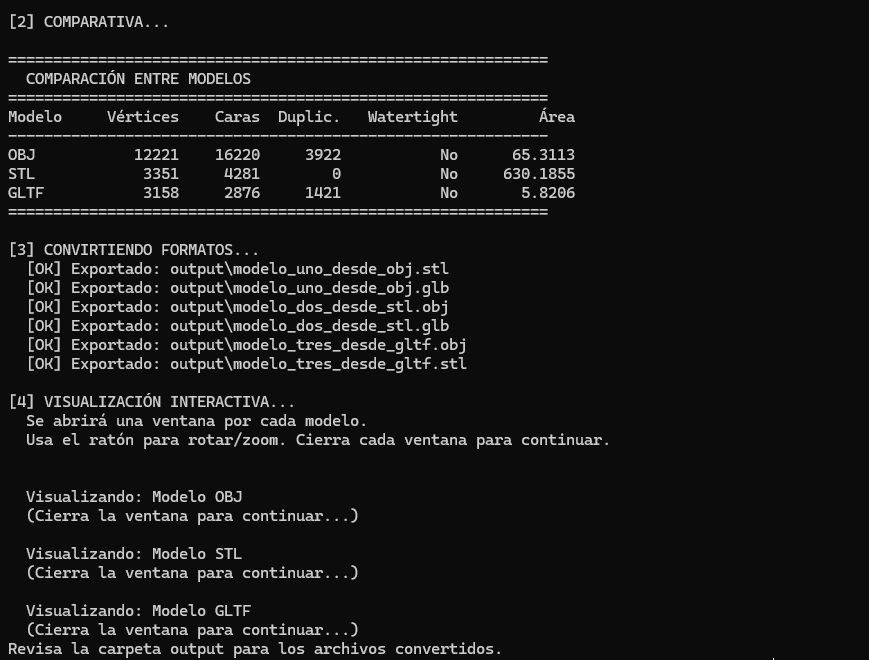
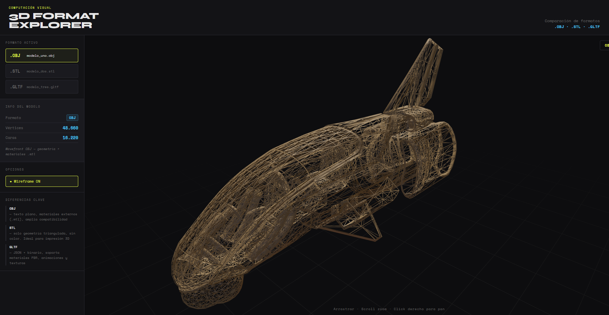
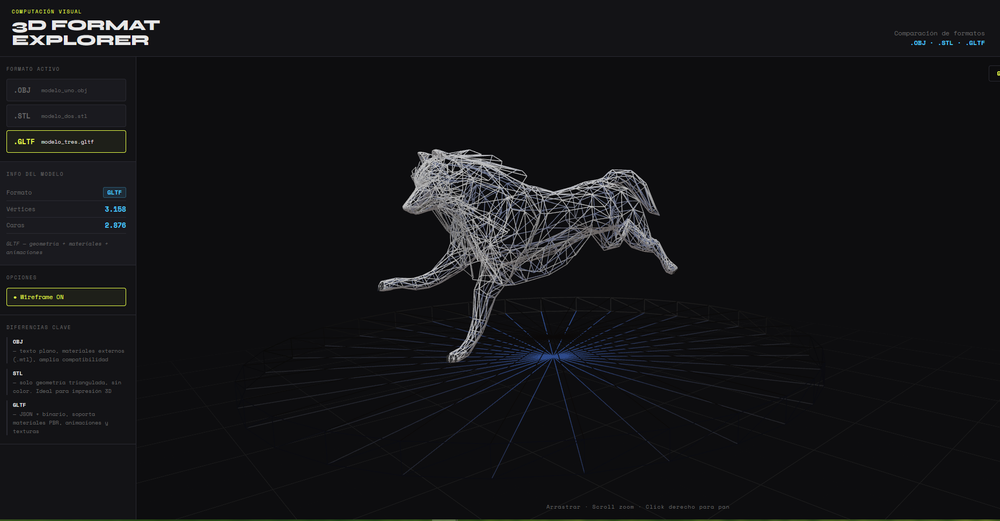

# Taller - Conversion Formatos 3D

**Estudiante:** Andres Felipe Galindo Gonzalez
**Fecha:** 21 de Febrero, 2026

## 📝 Descripción

Este taller consiste en el análisis, comparación y conversión de modelos 3D en formatos .OBJ, .STL y .GLTF utilizando Python (con la librería trimesh) y Three.js. El objetivo es comprender la estructura interna de la geometría, tales como vértices, caras y normales, y realizar una comparación de sus caracteristicas.

## 🛠️ Implementaciones

### 1. Python

**Descripción:**
Este desarrollo implementa un flujo de trabajo automatizado en Python diseñado para la gestión y procesamiento de activos tridimensionales en formatos .OBJ, .STL y .GLTF. Utilizando la librería trimesh, el sistema realiza una extracción de métricas geométricas como el conteo de vértices y caras, la validación de mallas herméticas o cerradas (watertight) y el cálculo de áreas superficiales con el fin de evaluar la composición de cada modelo.

**Características:**

- Carga de diversos formatos: Lectura de modelos en archivos .OBJ, .STL y .GLTF.
- Análisis automático: Cálculo de la cantidad de puntos (vértices) y triángulos (caras) que forman el objeto.
- Revisión de errores: Identificación de piezas duplicadas y verificación de si el modelo está "cerrado" (sin huecos).
- Cálculo de medidas: Obtención automática del tamaño real del objeto y su área superficial.
- Conversión de archivos: Capacidad de transformar un modelo de un formato a otro (por ejemplo, pasar de STL a OBJ).
- Visualización 3D: Ventana interactiva para ver y rotar el modelo con el ratón.

**Tecnologías:**

- Python: El lenguaje principal donde corre todo el proceso.
- Trimesh: La herramienta que permite leer, editar y guardar los archivos 3D.
- NumPy: Utilizada para realizar los cálculos matemáticos de las coordenadas.
- Pyglet: La tecnología encargada de abrir la ventana de visualización 3D.

**Código relevante:**

```python
# FUNCIÓN: Convertir y guardar en otro formato
def export_mesh(mesh, filename):
    """Exporta la malla al formato indicado por la extensión del filename."""
    out_path = os.path.join(OUTPUT_DIR, filename)
    mesh.export(out_path)
    print(f"  [OK] Exportado: {out_path}")
    return out_path
```

```python
# FUNCIÓN: Cargar modelo (OBJ, STL, GLTF)
# trimesh puede devolver Mesh o Scene según el archivo
def load_mesh(path):
    """Carga un modelo 3D y lo convierte a trimesh.Trimesh si es una escena."""
    loaded = trimesh.load(path, force="mesh")
    if isinstance(loaded, trimesh.Scene):
        # Combinar todas las geometrías de la escena en una sola malla
        meshes = list(loaded.geometry.values())
        if len(meshes) == 0:
            raise ValueError(f"No se encontraron geometrías en {path}")
        loaded = trimesh.util.concatenate(meshes)
    return loaded
```

**Resultados:**




---

### 2. Three.js

**Descripción:**
Esta implementación consiste en un explorador interactivo de formatos 3D desarrollado sobre entorno web. La aplicación permite la visualización dinámica y comparativa de modelos en formatos .OBJ, .STL y .GLTF, integrando un sistema de gestión de estados para alternar en tiempo real. El desarrollo se centra en la interpretación técnica de cada formato, extrayendo dinámicamente el conteo de vértices y caras desde la geometría cargada y presentando una interfaz de usuario que facilita la inspección de las diferencias importantes entre los modelos analizados.

**Características:**

- Carga multi-formato: Implementación de cargadores específicos (OBJLoader, STLLoader, GLTFLoader) para la importación selectiva de modelos.
- Análisis dinámico de geometría: Sistema de recorrido (traverse) que calcula en tiempo real el número de vértices y polígonos de cada malla al ser montada en la escena.
- Control de renderizado: Selector de modo wireframe para visualizar la topología y densidad de la malla de cada modelo.
- Interfaz HUD Informativa: Panel lateral y superpuesto que muestra metadatos técnicos y descripciones educativas sobre las capacidades de cada formato.
- Entorno interactivo: Escena equipada con iluminación (ambiental, direccional y puntual), sistema de sombras y controles orbitales para una exploración del objeto.

**Tecnologías:**

- React: Marco de trabajo para la lógica de la interfaz y gestión del estado de la aplicación.
- Three.js: Motor gráfico 3D base para el renderizado web.
- React Three Fiber: Puente declarativo para integrar Three.js dentro del ciclo de vida de React.
- @react-three/drei: Biblioteca de utilidades para simplificar la implementación de controles, cargadores y elementos del entorno.
- CSS3: Diseño de interfaz personalizado con enfoque en experiencia de usuario (UX) y visualización de datos.

**Código relevante:**

```javascript
// Contar vértices/caras solo una vez al cargar
useEffect(() => {
  let verts = 0,
    faces = 0;
  obj.traverse((child) => {
    if (child.isMesh && child.geometry) {
      const pos = child.geometry.attributes.position;
      if (pos) verts += pos.count;
      if (child.geometry.index) faces += child.geometry.index.count / 3;
      else if (pos) faces += pos.count / 3;
    }
  });
  onInfo({ vertices: verts, faces: Math.round(faces) });
}, [obj]);
```

**Resultados:**




---

## 🤖 Prompts Utilizados

    "¿Cuáles son las técnicas que se emplean para convertir formatos de modelos 3D y qué herramientas existen en Python y Three.js?"
    "¿Cuáles son las características de los formatos .obj, .gltf y .stl, y qué los diferencia de los demás?"
    "Defíneme algunas características de los modelos 3D, como texturas, suavidad, materiales, etc."
    "Ayúdame a resolver el siguiente error técnico con la librería vedo en Python."
    "¿Cómo puedo implementar un programa que me permita interactuar con los diferentes modelos mediante una interfaz gráfica moderna?"
    "Ayúdame a corregir la ortografía y redacción del siguiente texto explicativo sobre el taller."
    "Explícame el código en Python línea a línea y señálame cambios interesantes para probarlos."
    "Corrige la funcionalidad del botón wireframe, ya que no realiza ninguna acción; indícame el porqué y dónde se encuentra el error."
    "¿Cuál es la estructura adecuada de un proyecto cuando se trabaja con el marco React y se emplea Vite?"
    "Ayúdame a generar la estructura del programa en Python/Three.js e indícame cómo funciona y qué podría mejorar."
    Nota: Las principales consultas se enfocaron en entender el problema y las caracteristicas que se debia cumplir en el código.

## 📚 Aprendizajes

- La selección del formato debe guiarse por un análisis del objetivo de uso, donde STL es útil para la impresión 3D y glTF es útil para la web; además, este último tiene buenas características respecto a los componentes extras como texturas.
- Comprendí qué es el watertight y que es de gran importancia en el cálculo de superficie y volúmenes, en especial para formatos de impresión, ya que este determina si la malla es cerrada.
- Es interesante que Three.js tenga sus propios cargadores según el formato seleccionado.
- STL solo maneja mallas triangulares, es decir, triángulos interconectados, proceso que se denomina teselación.
- STL es un poco pesado y generalmente no soporta color, textura ni animación.
- OBJ sí soporta textura y color mediante un archivo .mtl.
- glTF es muy útil para la web, como juegos o realidad aumentada; además sus mallas están optimizadas para GPU y, además de soportar texturas y colores, también es liviano en peso.
- Mesh (malla) es el esqueleto del objeto, compuesto por vértices (puntos en el espacio), aristas (líneas que unen puntos) y caras (superficies planas creadas por las aristas).
- El material define cómo actúa una superficie con la luz; hoy se usa el estándar PBR (Physically Based Rendering).
- La textura es una imagen 2D que se envuelve sobre los objetos 3D, lo que se llama mapeo UV.
- Un concepto importante son las normales, que son vectores invisibles que apuntan hacia afuera de cada cara o vértice, y permiten que el motor de renderizado identifique hacia dónde va la luz.

## 🔧 Dificultades Encontradas

- El principal reto fue configurar el entorno virtual de manera correcta ya que librerías como trimesh requieren de dependencias adicionales como scipy y networkx para realizar operaciones matemáticas complejas, lo que inicialmente generó errores de ejecución.
- Se presentó una dificultad al cargar modelos .gltf que dependen de archivos .bin externos; esto recalco la importancia de utilizar formatos integrados como .glb para facilitar la portabilidad.
- Implementar el botón de wireframe requirió asegurar que los materiales se actualizaran correctamente a través del método traverse de Three.js, evitando mutaciones directas que no fueran detectadas por el ciclo de vida de React.

## 🚀 Cómo Ejecutar

### Three.js

```bash
cd threejs
npm install
npm run dev
```

### Python

```bash
cd python
python comparador_conversor.py
```

## 🔗 Referencias

- [Three.js Documentation](https://threejs.org/)
- [React Three Fiber](https://docs.pmnd.rs/react-three-fiber)
- [Trimesh Documentation](https://trimsh.org/)
