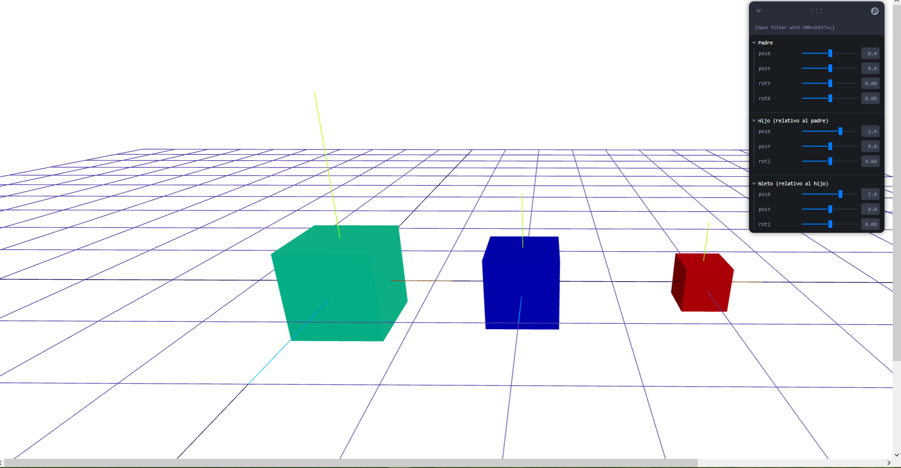
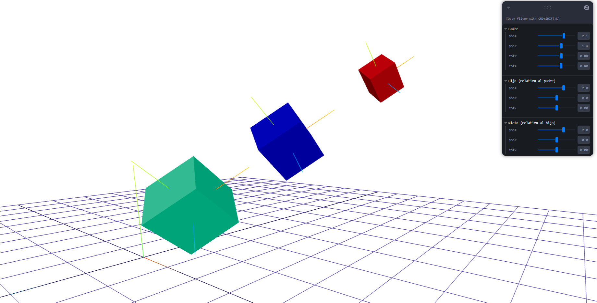
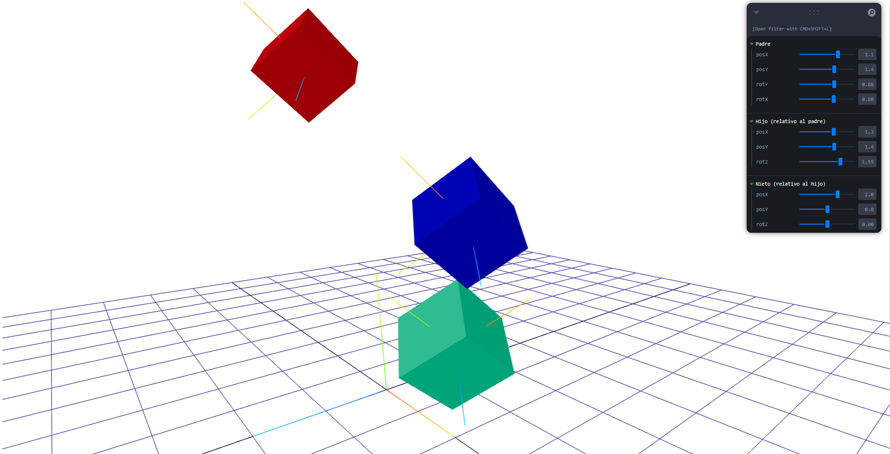
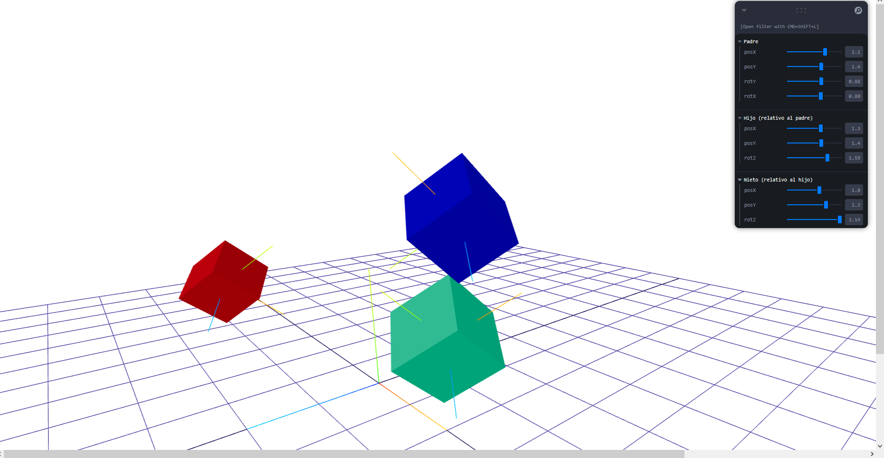

# Taller - Jerarquias Transformaciones

**Estudiante:** Andres Felipe Galindo Gonzalez  
**Fecha:** 21 de Febrero, 2026

---

## 📝 Descripción

Este taller consiste en la implementación de estructuras jerárquicas y árboles de transformación para organizar escenas 3D y simular movimiento relativo entre objetos. El objetivo es comprender cómo las transformaciones (traslación, rotación y escala) se propagan en cascada desde los nodos padre hacia los nodos hijos dentro de un árbol de escena, y visualizar estos efectos en tiempo real mediante controles interactivos.

Se implementó una escena con tres niveles jerárquicos (padre → hijo → nieto) usando React Three Fiber, donde cada nodo puede ser transformado independientemente a través de sliders provistos por la librería Leva, permitiendo observar de manera directa cómo las transformaciones del padre afectan a todos sus descendientes.

---

## 🛠️ Implementaciones

### Three.js con React Three Fiber

**Descripción:**  
Se desarrolló una escena 3D interactiva con una jerarquía de tres niveles representada por cubos de colores. Cada cubo tiene sus propios ejes locales visualizados mediante `axesHelper`, lo que permite observar cómo el sistema de coordenadas local de cada nodo cambia al aplicar transformaciones a sus ancestros. La interfaz de control usa Leva para modificar en tiempo real la posición y rotación de cada nodo jerárquico.

**Características:**

- Jerarquía de tres niveles: padre → hijo → nieto, implementada con `<group>` anidados en React Three Fiber.
- Controles en tiempo real: Panel lateral con sliders (Leva) separados por nivel para controlar traslación (posX, posY) y rotación (rotX, rotY, rotZ).
- Visualización de ejes locales: `axesHelper` en cada nodo para mostrar su sistema de coordenadas propio y evidenciar la herencia de transformaciones.
- Bonus implementado: Tercer nivel de jerarquía (nieto) con transformaciones encadenadas respecto al hijo.
- OrbitControls para navegar libremente la escena en 3D.
- Grid y ejes del mundo como referencia espacial global.

**Tecnologías:**

- React + Vite: Entorno de desarrollo y marco de trabajo para la interfaz.
- Three.js: Motor gráfico 3D base.
- React Three Fiber: Puente declarativo entre React y Three.js.
- @react-three/drei: Utilidades como OrbitControls y helpers de escena.
- Leva: Librería de controles GUI para sliders en tiempo real.

**Código relevante:**

Estructura de la jerarquía en `Scene.jsx`:

```jsx
// NIVEL 1 — PADRE
// Posición y rotación en espacio MUNDO
<group
  position={[padre.posX, padre.posY, 0]}
  rotation={[padre.rotX, padre.rotY, 0]}
>
  <mesh>
    <boxGeometry args={[1, 1, 1]} />
    <meshStandardMaterial color="#4488ff" />
  </mesh>
  <axesHelper args={[1.2]} />

  {/* NIVEL 2 — HIJO: posición relativa al PADRE */}
  <group position={[hijo.posX, hijo.posY, 0]} rotation={[0, 0, hijo.rotZ]}>
    <mesh>
      <boxGeometry args={[0.8, 0.8, 0.8]} />
      <meshStandardMaterial color="#44cc66" />
    </mesh>
    <axesHelper args={[1]} />

    {/* NIVEL 3 — NIETO BONUS: posición relativa al HIJO */}
    <group position={[nieto.posX, nieto.posY, 0]} rotation={[0, 0, nieto.rotZ]}>
      <mesh>
        <boxGeometry args={[0.5, 0.5, 0.5]} />
        <meshStandardMaterial color="#ff4444" />
      </mesh>
      <axesHelper args={[0.7]} />
    </group>
  </group>
</group>
```

Controles con Leva en `App.jsx`:

```jsx
const padre = useControls("Padre", {
  posX: { value: 0, min: -5, max: 5, step: 0.1 },
  posY: { value: 0, min: -5, max: 5, step: 0.1 },
  rotY: { value: 0, min: -Math.PI, max: Math.PI, step: 0.01 },
  rotX: { value: 0, min: -Math.PI, max: Math.PI, step: 0.01 },
});

const hijo = useControls("Hijo (relativo al padre)", {
  posX: { value: 2, min: -5, max: 5, step: 0.1 },
  posY: { value: 0, min: -5, max: 5, step: 0.1 },
  rotZ: { value: 0, min: -Math.PI, max: Math.PI, step: 0.01 },
});

const nieto = useControls("Nieto (relativo al hijo)", {
  posX: { value: 2, min: -5, max: 5, step: 0.1 },
  posY: { value: 0, min: -5, max: 5, step: 0.1 },
  rotZ: { value: 0, min: -Math.PI, max: Math.PI, step: 0.01 },
});
```

---

## 🖼️ Resultados Visuales

### Escena con jerarquía en estado inicial



### Control de transformaciones con sliders



### Rotación del padre propagándose a hijo y nieto



### Vista de los ejes locales por nodo



---

## 🤖 Prompts Utilizados

- "Ayúdame a crear una escena con jerarquía padre-hijo-nieto en React Three Fiber usando `<group>` anidados y explicame el código a detalle para que pueda modificarlo"
- "¿Cómo funcionan los ejes locales en Three.js y cómo puedo visualizarlos con axesHelper dentro de una jerarquía?"
- "Explícame la diferencia entre espacio mundo y espacio local en un árbol de transformaciones 3D."
- "Corrige el error de JSX donde los comentarios dentro de `return()` necesitan un fragmento vacío `<>`."
- "Los sliders de Leva están colocando los cubos en posiciones incorrectas, ayúdame a ajustar los valores por defecto."
- "Explícame a fondo cómo se multiplican las matrices de transformación en una cadena padre-hijo y qué efecto tiene rotar el padre sobre las coordenadas del nieto."

---

## 📚 Aprendizajes

- Cada `<group>` en React Three Fiber define un nodo en el árbol de escena con su propio sistema de coordenadas local; anidar grupos es la forma de crear relaciones padre-hijo.
- La posición de un hijo siempre es relativa a su padre, no al mundo. Si el padre se mueve o rota, el hijo hereda esa transformación automáticamente.
- Internamente, Three.js representa cada transformación como una matriz 4×4, y la posición final de un objeto en el mundo es el resultado de multiplicar en cadena todas las matrices de sus ancestros: `M_mundo = M_padre × M_hijo × M_nieto`.
- Los `axesHelper` dentro de cada nodo muestran su sistema de coordenadas local y permiten ver visualmente cómo una rotación en el padre cambia la orientación de los ejes del hijo, lo que afecta la dirección en que se mueven sus hijos cuando se trasladan.
- El experimento más interesante fue rotar el hijo en Z 90° y luego mover el nieto en posX: el nieto se mueve verticalmente en el mundo porque su "derecha local" apunta hacia arriba del mundo.

---

## 🔧 Dificultades Encontradas

- Los valores por defecto de los sliders del nieto (`posX: 2.2, posY: 1.9`) lo separaban visualmente del hijo, dando la impresión de que no estaba correctamente anidado. Ajustar los defaults a `(2, 0)` resolvió la confusión visual.
- El `axesHelper` global del mundo aparecía desproporcionadamente grande; fue necesario limitar su tamaño con `args={[2]}` para que no tomara todo el campo visual.

---

## 🚀 Cómo Ejecutar

```bash
cd threejs
npm install
npm run dev
```

Abrir `http://localhost:5173` en el navegador. El panel de Leva aparece en la esquina superior derecha con tres secciones de sliders (Padre, Hijo, Nieto).

---

## 🔗 Referencias

- [React Three Fiber Documentation](https://docs.pmnd.rs/react-three-fiber)
- [Three.js Documentation](https://threejs.org/docs/)
- [Leva – GUI Controls for React](https://github.com/pmndrs/leva)
- [@react-three/drei](https://github.com/pmndrs/drei)
