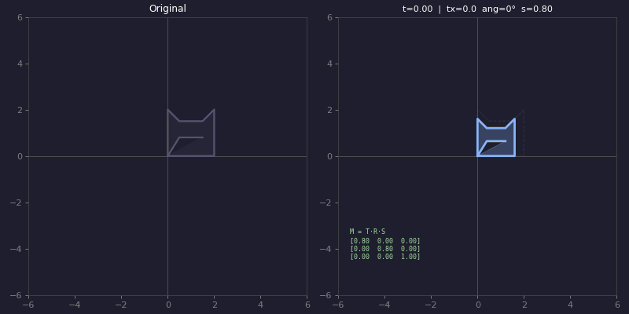
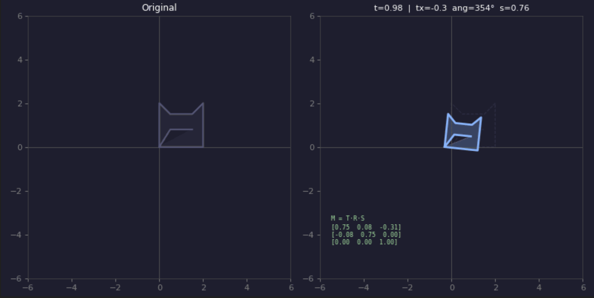
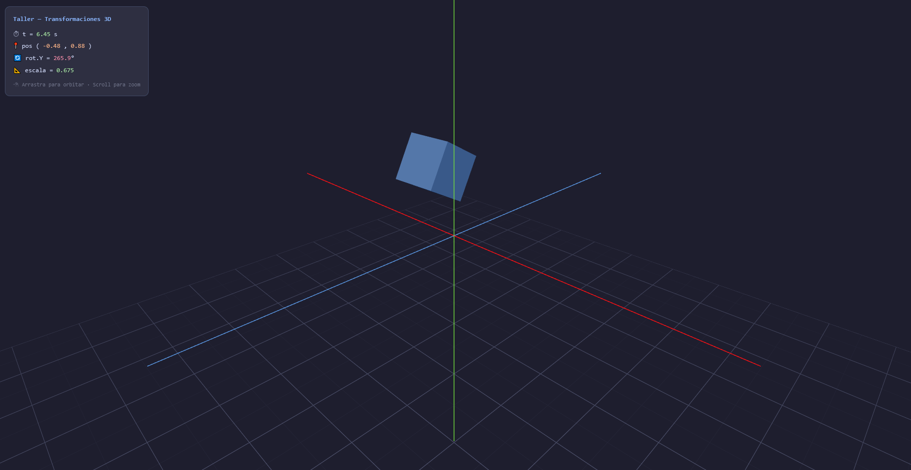
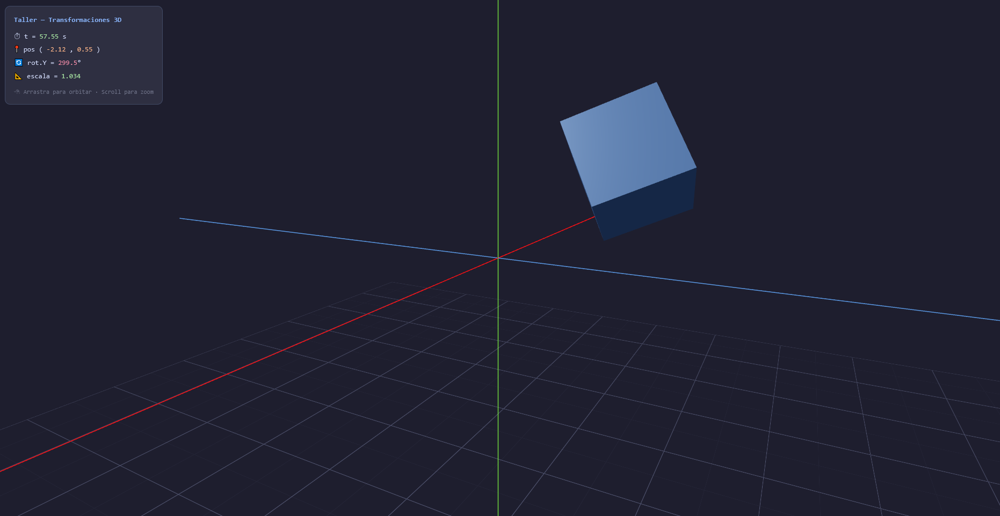
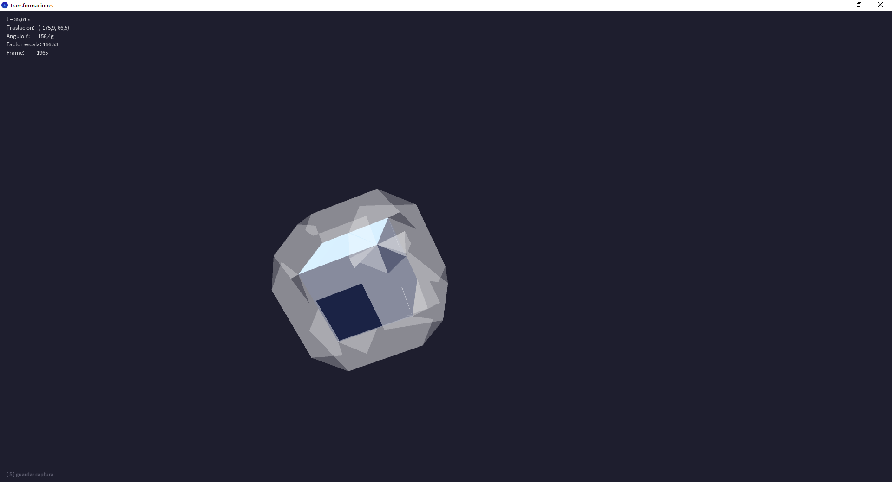

# Taller — Transformaciones Básicas en Computación Visual

**Estudiante:** Andres Felipe Galindo Gonzalez
**Fecha:** 21 de Febrero, 2026

---

## 📝 Descripción

Este taller explora los conceptos mas importantes de las **transformaciones geométricas** como lo son las siguientes(traslación, rotación y escala), son implementadas en tres entornos de programación visual distintos: Python, Processing y Three.js con React Three Fiber. Ya que el objetivo fue construir un proyecto básico, es decir, una escena simple con un objeto al que se le aplican transformaciones animadas en función del tiempo, usando matrices de transformación homogéneas en Python y las funciones propias de cada plataforma en los demás entornos.

---

## 🛠️ Implementaciones

### 1. Python (venv)

**Descripción:**
Se implementó una figura 2D (Cara de un gato) representada en **coordenadas homogéneas** `[x, y, 1]`, lo que permite aplicar traslación, rotación y escala mediante una sola multiplicación de matrices 3×3. La animación itera sobre `t ∈ [0, 1]` y exporta el resultado como un GIF animado usando `imageio`.

**Características:**

- Matrices de transformación homogéneas construidas manualmente con `numpy`
- Transformación combinada `M = T · R · S` aplicada frame a frame
- Visualización dual: figura original vs figura transformada
- Muestra la matriz resultante en pantalla en cada frame
- Exporta la animación como GIF con `imageio`

**Tecnologías:**

- Python 3.10+
- numpy
- matplotlib
- imageio
- venv (entorno virtual)

**Código relevante:**

```python
# Matrices de transformación homogéneas 3×3
def mat_traslacion(tx, ty):
    return np.array([[1, 0, tx], [0, 1, ty], [0, 0, 1]], dtype=float)

def mat_rotacion(angulo_rad):
    c, s = np.cos(angulo_rad), np.sin(angulo_rad)
    return np.array([[c, -s, 0], [s, c, 0], [0, 0, 1]], dtype=float)

def mat_escala(sx, sy):
    return np.array([[sx, 0, 0], [0, sy, 0], [0, 0, 1]], dtype=float)

# Combinación: T · R · S  (el orden importa)
M = mat_traslacion(tx, 0) @ mat_rotacion(angulo) @ mat_escala(escala, escala)
figura_transformada = M @ figura_original
```

**Resultados:**




---

### 2. Three.js con React Three Fiber

**Descripción:**
Se creó una escena WebGL con un cubo 3D animado mediante el hook `useFrame` de React Three Fiber, que se ejecuta cada frame del renderizado (equivalente al `draw()` de Processing). Las tres transformaciones se aplican directamente sobre la referencia al objeto Three.js para máximo rendimiento, sin re-renderizar React.

**Características:**

- Traslación en trayectoria elíptica con `Math.cos(t)` y `Math.sin(t)`
- Rotación incremental acumulativa en los tres ejes
- Escala pulsante con `1 + 0.4 * Math.sin(t * 1.8)`
- Panel HUD en HTML que muestra los valores en tiempo real
- Ejes de referencia X (rojo), Y (verde), Z (azul)
- `OrbitControls` para navegar la escena con el mouse

**Tecnologías:**

- React 18
- Three.js
- React Three Fiber (`@react-three/fiber`)
- Drei (`@react-three/drei`)
- Vite

**Código relevante:**

```jsx
useFrame((state) => {
  const t = state.clock.elapsedTime;

  // 1. Traslación elíptica
  mesh.position.x = 2.5 * Math.cos(t * 0.7);
  mesh.position.y = 1.2 * Math.sin(t * 1.1);

  // 2. Rotación incremental
  mesh.rotation.x += 0.008;
  mesh.rotation.y += 0.013;

  // 3. Escala pulsante
  const s = 1 + 0.4 * Math.sin(t * 1.8);
  mesh.scale.set(s, s, s);
});
```

**Resultados:**



---

### 3. Processing (3D)

**Descripción:**
Se implementó un sketch en modo `P3D` con un cubo que recibe las tres transformaciones simultáneamente. Se utilizan `pushMatrix()` y `popMatrix()` para aislar las transformaciones del cubo del resto de la escena, permitiendo dibujar un HUD de texto 2D encima del 3D sin que herede las transformaciones del objeto.

**Características:**

- Traslación ondulada con `cos()` y `sin()` sobre `millis()`
- Rotación continua en los tres ejes usando `frameCount`
- Escala pulsante con `sin(t * 2.0)`
- Iluminación con `pointLight()` y `ambientLight()`
- HUD informativo con valores en tiempo real
- Tecla `S` para guardar capturas

**Tecnologías:**

- Processing 4 (modo P3D)

**Código relevante:**

```java
pushMatrix();
  // 1. Traslación al centro + trayectoria elíptica
  translate(width/2.0 + tx,  height/2.0 + ty,  0);

  // 2. Rotación en los tres ejes (frameCount × velocidad)
  rotateX(angX);
  rotateY(angY);
  rotateZ(angZ);

  // 3. Escala: oscila entre (1 - amplEsc) y (1 + amplEsc)
  scale(escalaBase * (1.0 + amplEsc * sin(t * 2.0)));

  box(1);
popMatrix();
```

**Resultados:**




---

## 🤖 Prompts Utilizados

- "Crea un script Python que aplique traslación, rotación y escala a una figura 2D usando matrices de transformación homogéneas con numpy, y exportado como GIF con y comenta cada sección, explicando porque es importante y que modificaciones se pueden realizar"
- "¿Cuál es la diferencia entre aplicar M = T·R·S vs M = S·R·T?"
- "En React Three Fiber, ¿cómo modifico posición, rotación y escala de un mesh cada frame sin re-renderizar el componente?"
- "En Processing P3D el cubo solo aparece cuando redimensiono la ventana, ¿qué puede estar causando eso?"
- "¿Cuál es la forma correcta de dibujar texto 2D encima de geometría 3D en Processing P3D sin que herede las transformaciones?"
- "Genera un formato para el README del taller siguiendo las siguientes condiciones..."
- "Ayúdame a corregir la ortografía y redacción del siguiente texto explicativo sobre el taller."
- Nota: La mayoría de consultas se centraron en resolver conflictos entre `smooth(0)` y el renderizador P3D (tomo demasiado tiempo), y en entender el orden correcto de multiplicación de matrices.

---

## 📚 Aprendizajes

### Conceptos Clave

- **Coordenadas homogéneas:** Añadir una dimensión extra `[x, y, 1]` permite representar traslación, rotación y escala como matrices del mismo tamaño (3×3 en 2D), unificando las tres transformaciones en una sola multiplicación.
- **Orden de multiplicación:** `T·R·S` no es equivalente a `S·R·T`. La convención estándar es escalar primero, luego rotar, luego trasladar — de derecha a izquierda en la multiplicación.
- **pushMatrix / popMatrix:** La forma correcta de aislar transformaciones en Processing. Evita que objetos como texto o HUDs hereden las rotaciones y escalas de la geometría principal.
- **useFrame en R3F:** Equivalente al `draw()` de Processing. Modificar propiedades del mesh directamente vía `useRef` evita re-renders de React y mantiene 60 fps.

### Descubrimientos

El mismo concepto matemático (matrices de transformación) se implementa de formas muy distintas según el entorno, en python se construye explícitamente como una multiplicación de matrices numpy; en processing y three.js las funciones del sistema (`translate`, `rotate`, `scale`) construyen esas mismas matrices internamente. Entender la capa matemática subyacente permite predecir el comportamiento visual sin importar la plataforma o software que se emplee.

---

## 🔧 Dificultades Encontradas

- Me tomó bastante tiempo descubrir que llamar a smooth(0) en Processing P3D causaba un error visual donde el primer frame no cargaba hasta mover la ventana; la solución fue simplemente eliminar esa llamada.
- Tuve problemas con resetMatrix() al intentar dibujar el HUD de texto, ya que borraba la posición de la cámara. Aprendí que la combinación correcta para estos casos es usar camera() junto con hint(DISABLE_DEPTH_TEST).
- La mayor parte de las dificultades aparecieron al trabajar con Processing, especialmente al intentar que la geometría 3D y los elementos informativos en 2D convivieran correctamente en la misma escena.

---

## 🚀 Cómo Ejecutar

### Python

```bash
cd python
python -m venv venv
venv\Scripts\activate        # Windows
pip install matplotlib numpy imageio
python transformaciones.py
# Genera: animacion_transformaciones.gif
```

### Three.js

```bash
cd threejs
npm install
npm run dev
# Abrir: http://localhost:5173
```

### Processing

```
Abrir Processing 4
File → Open → processing/transformaciones/transformaciones.pde
Presionar ▶ para ejecutar
Tecla S → guarda captura en la carpeta del sketch
```

---

## 🔗 Referencias

- [Three.js Documentation](https://threejs.org/docs/)
- [React Three Fiber](https://docs.pmnd.rs/react-three-fiber)
- [Drei Helpers](https://github.com/pmndrs/drei)
- [Processing Reference](https://processing.org/reference/)
- [Transformaciones homogéneas — Wikipedia](https://en.wikipedia.org/wiki/Homogeneous_coordinates)
